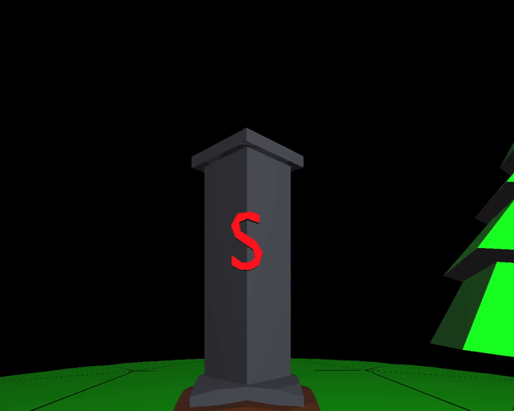

# NEGE-CPP
### Non-Euclidean Graphics Engine written in C++ and OpenGL
This project was a part of my thesis. It was created to showcase the principles of hyperbolic rendering and provide visual examples of how a hyperbolic 3-manifold can be represented in computer graphics. It uses gyrovector space and the Poincaré model for calculations, followed by the Beltrami-Klein model for the final projection.

## How it looks
Here are some frames captured from examples to illustrate how the hyperbolic world appears when projected using the Beltrami-Klein model.

### Holonomy effect


### Comparison to a 'similar' Euclidean scene


### An example of how tall objects behave inside the engine


## Compile and run
Requirements:
* GNU Make
* gcc and g++
* flex
* Precompiled GLFW 3.4 shared library
* ffmpeg (only for creating example presentation videos)

[Here](https://www.glfw.org/docs/3.4/compile_guide.html) you can find how to compile GLFW 3.4 (remember to include flag necessary to make DLL / shared library / dynamic library)

To build the project, first ensure you have **glfw3.dll** (or **libglfw.so.3** for Linux) in the **lib** folder in the project's root directory, as well as the other listed requirements installed on your system. Then you can build examples by simply using:
```
make examples
```

The executables will be located inside the **bin** folder. To run them, make sure that **glfw3.dll** is located inside the **bin** folder as well (for Linux, place **libglfw.so.3** inside **/usr/lib** or any other shared libraries folder).
